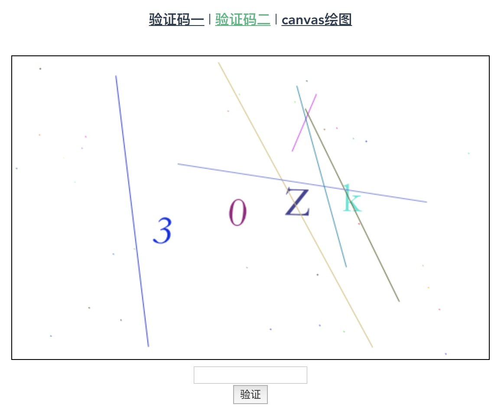

<!--
 * @Date: 2020-03-01 10:44:25
 * @LastEditors  : Lee
 * @LastEditTime : 2020-03-05 21:15:55
 -->
# canvas

## Project setup
```
yarn install
```

### Compiles and hot-reloads for development
```
yarn serve
```

### Compiles and minifies for production
```
yarn build
```

### Lints and fixes files
```
yarn lint
```

### Customize configuration
See [Configuration Reference](https://cli.vuejs.org/config/).

## 图片预览




